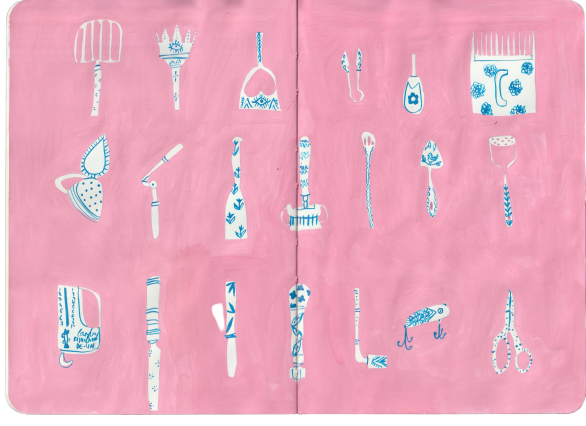

# 🚩 Random Pieces

[_Rebecca Green is an Illustrator & Author_\
_based in Michigan._](https://www.thisiscolossal.com/)
------------------------------------------------------

Making changes here.&#x20;

And more changes&#x20;

<figure><figcaption></figcaption></figure>

can't replicathe&#x20;

. sdhwksjnc,  hdoiwsjnckdsgih

Her hand painted illustrations showcase the timeless celebration of seasons, story, and home. She is most known for her work in picture books.

Doing changes as a Creator

<figure><figcaption>
e3ygwdfvhbsqkj2ehi3ufgrvcd 3ueiorfgyvhdjbcsenwqk2ieo3uhrgyfhvbdjscnkmjlweo3i euoiwhfbdjnsakwiehugbhfdsjndehjfbdcs
</figcaption></figure>

[In Las Vegas](https://www.thisiscolossal.com/category/design/), the Office of Collecting & Design is a haven for the minute, the small objects that have been broken, separated from their partners, or grown obsolete and somehow found their way into the hands of Jessica Oreck. An artist and filmmaker, Oreck serves as both caretaker and cultivator of this magical and somewhat bizarre “collection of collections,” which houses everything from handmade sushi smaller than a pushpin and a teeny-tiny tube of Colgate to stone marbles and limbs detached from toy figures. Oreck spoke with Colossal managing editor Grace Ebert about the origin of the ever-expanding collection of miniatures, how respect and intuition ground her approach to the objects, and the mysterious story behind one of the strangest items she’s encountered.
