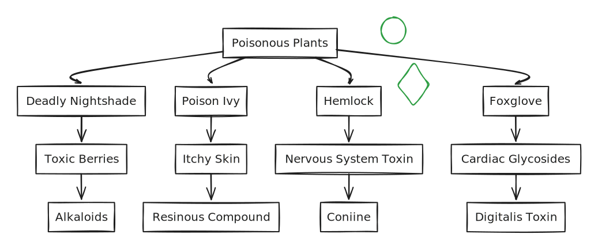

# 🕷️ Spiderman

$$
gvfdcsxamn n Wgyudjbhewsjn
$$


[https://petstore.swagger.io/v2/swagger.json](https://petstore.swagger.io/v2/swagger.json)



[https://petstore.swagger.io/v2/swagger.json](https://petstore.swagger.io/v2/swagger.json)


> ranslates topic names on incoming commands.
>
> This module requires one or more of the following options: `Topic`
>
> Specifies the translation to use. This option takes the following format:\
> _original_ _translated_
>
> The _original_ parameter can be a literal topic name or a PCRE regex. Any topic on any command tha

> Let’s observe the facts: Humans took more than a hundred thousand Earth years to progress from the Hunter-Gatherer Age to the Agricultural Age. To get from the Agricultural Age to the Industrial Age took a few thousand Earth years. But to go from the Industrial Age to the Atomic Age took only two hundred Earth years. Thereafter, in only a few Earth decades, they entered the Information Age. This civilization possesses the terrifying ability to accelerate their progress.

>

| Command                           | Description                                                                                                                                                                                                                                                                                                                                                                                                                                                                                                                                                                                                                                                                                                                                                                                                                                                                                                                                                                                                                                                                                                                                                                                                                                                                                                                                                                                                                                                                                                                                                                                                                                                                                                                                                 |
| --------------------------------- | ----------------------------------------------------------------------------------------------------------------------------------------------------------------------------------------------------------------------------------------------------------------------------------------------------------------------------------------------------------------------------------------------------------------------------------------------------------------------------------------------------------------------------------------------------------------------------------------------------------------------------------------------------------------------------------------------------------------------------------------------------------------------------------------------------------------------------------------------------------------------------------------------------------------------------------------------------------------------------------------------------------------------------------------------------------------------------------------------------------------------------------------------------------------------------------------------------------------------------------------------------------------------------------------------------------------------------------------------------------------------------------------------------------------------------------------------------------------------------------------------------------------------------------------------------------------------------------------------------------------------------------------------------------------------------------------------------------------------------------------------------------- |
| `amps-topic-translator`           | 
Translates topic names on incoming commands.

This module requires one or more of the following options: <code>Topic</code>

Specifies the translation to use. This option takes the following format: <em>original</em> <em>translated</em>

The <em>original</em> parameter can be a literal topic name or a PCRE regex. Any topic on any command that matches that parameter will be converted to the translated topic.

For example, to convert the topic <code>legacy</code> to the topic <code>new</code>, you would specify the following option:
<pre><code>&#x3C;Options> &#x3C;Topic>legacy:new&#x3C;/Topic> &#x3C;/Options> 
</code></pre>
To translate any topic beginning with <code>/orders/northamerica</code> to <code>NAorders</code>, you would specify the following option:
<pre><code>&#x3C;Options> &#x3C;Topic>/^orders/northamerica:NAorders&#x3C;/Topic> &#x3C;/Options> 
</code></pre>                                                                                                                                                                                                                                                                                                                                                                                                                                                                                                                                                                                                                                                                                                                                                                                                          |
| `amps-conflated-topic-translator` | 
Translates an incoming <code>subscribe</code>, <code>sow_and_subscribe</code>, <code>delta_subscribe</code>, or <code>sow_and_delta_subscribe</code> command for a specific topic name as follows:
<ul><li>Translates the topic name on the command to a different topic name.</li></ul>
Adds a conflation interval to the command, if there is no conflation interval specified on the incoming command.

This module can be useful for removing a conflated topic that is infrequently-used, or for which subscribers only monitor a small number of messages out of the overall topic.

This module requires one or more of the following options: <code>Topic</code>

Specifies the translation to use. This option takes the following format: <em>original</em> <em>translated</em>

The <em>interval</em> specifies the conflation interval to apply to the translated commands if one is not provided.

For example, to convert all subscriptions to the topic <code>orders</code> to the topic <code>orders-C</code>, and guarantee that each translated subscription has a conflation specified, with a 500 millisecond default for conflation, you would use the following options:
<pre><code>&#x3C;Options> &#x3C;Topic>orders:orders-C:500ms&#x3C;/Topic> &#x3C;/Options> 
</code></pre>
To convert all subscriptions to the topics <code>slowUpdates</code> and <code>verySlowUpdates</code> to the topic <code>updates</code> and guarantee that each translated subscription has a conflation specified, with a 2 second default for conflation, you would use the following options:
<pre><code>&#x3C;Options> &#x3C;Topic>slowUpdates:updates:2s&#x3C;/Topic> &#x3C;/Options> 
</code></pre> |
| `amps-correlation-id-timestamper` | 
Writes an ISO 8601 format timestamp to the correlation ID for <code>publish</code> and <code>delta_publish</code> messages received by AMPS.

This module can be useful for gaining a better understanding of AMPS message latency by facilitating the end to end latency measurement of a publish message.

This module supports a single option: <code>Override</code> If specified and set to <code>True</code>, the module will overwrite the correlation ID value if it is set. Otherwise, the value will not be overwritten. For example, to override an existing correlation ID, you would specify the following options:
<pre><code>&#x3C;Options> &#x3C;Override>True&#x3C;/Override> &#x3C;/Options> 
</code></pre>
With trace level logging enabled, a <code>17-0001</code> message would look like the below example, with the transport filter applied:
<pre><code>2024-01-12T14:01:42.5763790-08:00 [135] 
</code></pre>
The <code>correlation_id</code> field in the <code>publish</code> or <code>delta_publish</code> command header is the <code>correlation_id</code> value.

<em>Note:</em> For certain features such as bookmark subscriptions, SOW topics and views, you may see unexpected results. For example, in the case of a bookmark subscription, messages could be replayed that were received by AMPS hours previous to the bookmark subscription and therefore not be included in the subscription.
                                                                                                                                                                                                                                                                                  |

\[!IMPORTANT]

<figure><figcaption></figcaption></figure>

> For security reasons some mongo db operators are not available or are partially available.

> For security reasons some mongo db operators are not available or are partially available.

Adding headeer links [#rabbit-header-1](taryn-knights-work.md#rabbit-header-1 "mention")


[docs.yml](.gitbook/assets/docs.yml)



[docs.yml](.gitbook/assets/docs.yml)



[docs.yml](.gitbook/assets/docs.yml)



[docs.yml](.gitbook/assets/docs.yml)



[docs.yml](.gitbook/assets/docs.yml)



[docs.yml](.gitbook/assets/docs.yml)


<figure><figcaption></figcaption></figure>

***

***

devider here

***







1. dghsjkm
2. cvdsgbhnajmk


sdcxbanm


3. csvdgbahnj
4. fvdhsjnmkl;l,
5.

$$
f(x) = x₀ * e^{2 pi i \xi x}
$$

### Pigeons 🐦

can cannot

camping

hello doing changes hereeeeee

bhejdwknmksa

debsjkn

\->

<table data-card-size="large" data-view="cards"><thead><tr><th></th><th></th><th></th></tr></thead><tbody><tr><td></td><td></td><td></td></tr><tr><td></td><td></td><td></td></tr></tbody></table>

<table data-view="cards"><thead><tr><th align="center"></th><th></th><th></th><th data-hidden data-card-cover data-type="files"></th><th data-hidden data-card-target data-type="content-ref"></th></tr></thead><tbody><tr><td align="center">TITLE ONE</td><td></td><td></td><td><a href=".gitbook/assets/morningtinypawws_det1+copy (1).jpeg">morningtinypawws_det1+copy (1).jpeg</a></td><td><a href="https://www.thisiscolossal.com/">https://www.thisiscolossal.com/</a></td></tr><tr><td align="center">TITLE TWO</td><td></td><td></td><td><a href=".gitbook/assets/image.png">image.png</a></td><td><a href="nostalgia-of-banal-items-through-papier-mache.md">nostalgia-of-banal-items-through-papier-mache.md</a></td></tr><tr><td align="center">TITLE THREE</td><td></td><td></td><td><a href=".gitbook/assets/1.jpeg">1.jpeg</a></td><td><a href="./">.</a></td></tr></tbody></table>

<mark style="color:blue;">`GET`</mark>

Morning

Afternoon

_hello_

**bye**

commissioned him to shoot some creatures for a story on the Canadian Pigeon Fancier’s Association, the _Fancy Pigesons_ series began to take shape. “My intention was to juxtapose the lowly pigeon with formal portraiture techniques and provide a new perspective on something ubiquitous, bordering on completely invisible,” Burden shares. Set against solid, paper backdrops resting in a large, show cage, the images evoke studio shots and capture each creature’s unique features. The Kormorner tumbler, for example, appears as if it’s wearing a turtleneck of brown feathers with a puffy collar, while the Moden’s gleaming, iridescent neck contrasts the soft, black and orange plumes of its body. NMp

[#rebecca-green-is-an-illustrator-and-author-based-in-michigan.](./#rebecca-green-is-an-illustrator-and-author-based-in-michigan. "mention")

* [ ] Hello
* [ ] world
* [x] Maximus
* [x] freedom
* [x] Rome

<table><thead><tr><th width="268">Role</th><th>Capabilities</th></tr></thead><tbody><tr><td>Administrator</td><td>Has all admin privileges</td></tr><tr><td>Editor</td><td>Can edit the accessiblity</td></tr><tr><td>Viewer</td><td>Can only view the accessiblity</td></tr><tr><td>Guest</td><td>Can only view the accessiblity for certain pages</td></tr></tbody></table>



[_Rebecca Green is an Illustrator & Author_\
_based in Michigan._](https://www.thisiscolossal.com/)
------------------------------------------------------

Making changes here.

And more[ changes](./#rebecca-green-is-an-illustrator-and-author-based-in-michigan.)

dfvnkfeldl

## My heading 1

### My heading 2

<table data-view="cards"><thead><tr><th></th><th></th><th></th><th data-hidden data-card-target data-type="content-ref"></th><th data-hidden data-card-cover data-type="files"></th></tr></thead><tbody><tr><td>Hello !</td><td>testing this!</td><td></td><td><a href="./">.</a></td><td><a href=".gitbook/assets/H93A9948.jpeg">H93A9948.jpeg</a></td></tr><tr><td>dc</td><td>cd</td><td>dc</td><td></td><td></td></tr><tr><td>cd</td><td>d</td><td>d</td><td></td><td></td></tr><tr><td>typing hereedfns</td><td>bla bla dvbejkdsbjkvc</td><td>heya1</td><td><a href="nostalgia-of-banal-items-through-papier-mache.md">nostalgia-of-banal-items-through-papier-mache.md</a></td><td><a href=".gitbook/assets/morningtinypawws_det1+copy (1).jpeg">morningtinypawws_det1+copy (1).jpeg</a></td></tr><tr><td></td><td></td><td></td><td></td><td></td></tr></tbody></table>

#### My heading 3

//Simple Block 

//Block with Caption 

//Block with Alt text

<figure><figcaption></figcaption></figure>

//Block with Caption and Alt text

<figure><figcaption>
GitBook Logo
</figcaption></figure>


**Info hints** are great for showing general information, or providing tips and tricks.



**Success hints** are good for showing positive actions or achievements.



**Warning hints** are good for showing important information or non-critical warnings.



**Danger hints** are good for highlighting destructive actions or raising attention to critical information.



**This is a heading**

This is a line

This is an inline image

This is a second <mark style="color:orange;background-color:purple;">line</mark>


{% embed url="https://www.figma.com/file/rHyJpfRqtFo6w1YfISUjkX/GitBook?type=design&node-id=1152%3A58573&mode=design&t=WBoLaB8YcFwPThlD-1" %}

##

##

##

## ATD insights

ATD insights are created using statistics from your EOIs and machine learning algorithms on the Anvilogic platform. <mark style="color:orange;">Set</mark> [nostalgia-of-banal-items-through-papier-mache.md](nostalgia-of-banal-items-through-papier-mache.md "mention")<mark style="color:orange;">for</mark> a list of supported insights.

[nostalgia-of-banal-items-through-papier-mache.md](nostalgia-of-banal-items-through-papier-mache.md "mention")

<table data-view="cards"><thead><tr><th></th><th></th><th></th><th data-hidden data-card-target data-type="content-ref"></th></tr></thead><tbody><tr><td>Rebecca Green</td><td></td><td></td><td><a href="rebecca-greens-work.md">rebecca-greens-work.md</a></td></tr><tr><td>Taryn knight</td><td></td><td></td><td><a href="taryn-knights-work.md">taryn-knights-work.md</a></td></tr><tr><td>The barber of Siberia</td><td></td><td></td><td><a href="group-1/the-barber-of-siberia.md">the-barber-of-siberia.md</a></td></tr></tbody></table>

{% embed url="https://app.guideflow.com/player/CV9wMHCCMHY%3D" %}

<figure><figcaption></figcaption></figure>

 

<figure><figcaption></figcaption></figure>

 

<figure><figcaption></figcaption></figure>

Her hand painted illustrations showcase the timeless celebration of seasons, story, and home. She is most known for her work in picture books.

<mark style="color:blue;">**Doing changes as a Creator**</mark>

[In Las Vegas](https://www.thisiscolossal.com/category/design/), the Office of Collecting & Design is a haven for the minute, the small objects that have been broken, separated from their partners, or grown obsolete and somehow found their way into the hands of Jessica Oreck. An artist and filmmaker, Oreck serves as both caretaker and cultivator of this magical and somewhat bizarre “collection of collections,” which houses everything from handmade sushi smaller than a pushpin and a teeny-tiny tube of Colgate to stone marbles and limbs detached from toy figures. Oreck spoke with Colossal managing editor Grace Ebert about the origin of the ever-expanding collection of miniatures, how respect and intuition ground her approach to the objects, and the mysterious story behind one of the strangest items she’s encountered.


Oh my! this should work

