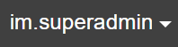

# 🐢 Turtle

<table data-full-width="true"><thead><tr><th width="313" data-type="files">Icon</th><th>Description</th></tr></thead><tbody><tr><td><a href=".gitbook/assets/username.png">username.png</a></td><td><p></p><p>allows user with proper user rights to activate notifications for such events as checklists, special events, pickup receipts overview (PDIX), TSG overview, location documents, webhooks, loading units history, advising history, log books.                                                                          </p></td></tr><tr><td><a href=".gitbook/assets/Screenshot_20.png">Screenshot_20.png</a></td><td>a feature allowing users to communicate with two types of driver roles (drivers and drivers global) through voice and text-based exchanges within a system. Users can compose and send messages to a driver, as well as receive and read messages sent to them. </td></tr></tbody></table>

<table data-full-width="true"><thead><tr><th width="313">Icon</th><th>Description</th></tr></thead><tbody><tr><td> Inline image</td><td>allows user with proper user rights to activate notifications for such events as checklists, special events, pickup receipts overview (PDIX), TSG overview, location documents, webhooks, loading units history, advising history, log books.                                                                          </td></tr><tr><td> Username</td><td>a feature allowing users to communicate with two types of driver roles (drivers and drivers global) through voice and text-based exchanges within a system. Users can compose and send messages to a driver, as well as receive and read messages sent to them. </td></tr></tbody></table>

```
this.gridOptions = {
- registerExternalResources: [new ExcelExportService()]
```

Preview allows you to view your content exactly as it will appear when published, enabling you to verify layout, formatting, and the overall look and feel before making it public. This feature is instrumental in ensuring accuracy and professionalism in your published materials.

 🎈&#x20;

## ANOTHER EDIT


HELLO WORLD!



[https://app.gitbook.com/o/d8f63b60-89ae-11e7-8574-5927d48c4877/s/NkEGS7hzeqa35sMXQZ4X/\~/diff/\~/changes/331/content-editor/searching-your-content](https://app.gitbook.com/s/NkEGS7hzeqa35sMXQZ4X/content-editor/searching-your-content) PUBLISHED CONTENT RELEASE

efrdwsqᵥₓfedsc


<table><thead><tr><th width="249"></th><th></th><th></th></tr></thead><tbody><tr><td>vgfecdwsᵥₓ </td><td>vgfecdwsᵥₓ</td><td></td></tr><tr><td></td><td>efrdwsag</td><td></td></tr><tr><td></td><td>rtfefredwsqʳᵛᶠᵉᶜᵈˢˣᵃ</td><td>ᵣᵥfₑcdₛₓₐ</td></tr></tbody></table>


sdcxbanm







5.

$$
f(x) = x₀ * e^{2 pi i \xi x}
$$

### Pigeons 🐦&#x20;

can cannot

camping

hello doing changes hereeeeee&#x20;

bhejdwknmksa


|          |   |   |
| -------- | - | - |
| Alphaˣˣˣ |   |   |
| Betaₓₓₓ  |   |   |
|          |   |   |

\->&#x20;

<table data-card-size="large" data-view="cards"><thead><tr><th></th><th></th><th></th></tr></thead><tbody><tr><td></td><td></td><td></td></tr><tr><td></td><td></td><td></td></tr></tbody></table>

<table data-view="cards"><thead><tr><th></th><th></th><th></th><th data-hidden data-card-cover data-type="files"></th><th data-hidden data-card-target data-type="content-ref"></th></tr></thead><tbody><tr><td></td><td></td><td></td><td><a href=".gitbook/assets/morningtinypawws_det1+copy (1).jpeg">morningtinypawws_det1+copy (1).jpeg</a></td><td><a href="https://www.thisiscolossal.com/">https://www.thisiscolossal.com/</a></td></tr><tr><td></td><td></td><td></td><td></td><td></td></tr><tr><td></td><td></td><td></td><td></td><td></td></tr></tbody></table>

<mark style="color:blue;">`GET`</mark>&#x20;

Morning

Afternoon

_hello_

**bye**

[After _Ottawa Magazine_](https://www.thisiscolossal.com/) commissioned him to shoot some creatures for a story on the Canadian Pigeon Fancier’s Association, the _Fancy Pigesons_ series began to take shape. “My intention was to juxtapose the lowly pigeon with formal portraiture techniques and provide a new perspective on something ubiquitous, bordering on completely invisible,” Burden shares. Set against solid, paper backdrops resting in a large, show cage, the images evoke studio shots and capture each creature’s unique features. The Kormorner tumbler, for example, appears as if it’s wearing a turtleneck of brown feathers with a puffy collar, while the Moden’s gleaming, iridescent neck contrasts the soft, black and orange plumes of its body. NMp

[#rebecca-green-is-an-illustrator-and-author-based-in-michigan.](./#rebecca-green-is-an-illustrator-and-author-based-in-michigan. "mention")


* [ ] Hello
* [ ] world
* [x] Maximus
* [x] freedom
* [x] Rome


<table><thead><tr><th width="268">Role</th><th>Capabilities</th></tr></thead><tbody><tr><td>Administrator</td><td>Has all admin privileges</td></tr><tr><td>Editor</td><td>Can edit the accessiblity</td></tr><tr><td>Viewer</td><td>Can only view the accessiblity</td></tr><tr><td>Guest. Reader</td><td>Can only view the accessiblity for certain pages</td></tr></tbody></table>



[_Rebecca Green is an Illustrator & Author_\
](https://www.thisiscolossal.com/)
----------------------------------

## My heading 1

### My heading 2

<table data-view="cards"><thead><tr><th></th><th></th><th></th><th data-hidden data-card-target data-type="content-ref"></th><th data-hidden data-card-cover data-type="files"></th></tr></thead><tbody><tr><td>Hello !</td><td>testing this!</td><td></td><td><a href="./">.</a></td><td><a href=".gitbook/assets/H93A9948.jpeg">H93A9948.jpeg</a></td></tr><tr><td>dc</td><td>cd</td><td>dc</td><td></td><td></td></tr><tr><td>cd</td><td>d</td><td>d</td><td></td><td></td></tr><tr><td>typing hereedfns</td><td>bla bla dvbejkdsbjkvc</td><td>heya1</td><td><a href="paper/">paper</a></td><td><a href=".gitbook/assets/morningtinypawws_det1+copy (1).jpeg">morningtinypawws_det1+copy (1).jpeg</a></td></tr><tr><td></td><td></td><td></td><td></td><td></td></tr></tbody></table>

#### My heading 3


//Block with Alt text

<figure><figcaption></figcaption></figure>

//Block with Caption and Alt text

<figure><figcaption><p>GitBook Logo</p></figcaption></figure>


**Info hints** are great for showing general information, or providing tips and tricks.



**Success hints** are good for showing positive actions or achievements.



**Warning hints** are good for showing important information or non-critical warnings.



**Danger hints** are good for highlighting destructive actions or raising attention to critical information.



**This is a heading**

This is a line

This is an inline image

This is a second <mark style="color:orange;background-color:purple;">line</mark>


{% embed url="https://www.figma.com/file/rHyJpfRqtFo6w1YfISUjkX/GitBook?type=design&node-id=1152%3A58573&mode=design&t=WBoLaB8YcFwPThlD-1" %}

##

##

##

## ATD insights

ATD insights are created using statistics from your EOIs and machine learning algorithms on the Anvilogic platform. <mark style="color:orange;">Set</mark> [paper](paper/ "mention")<mark style="color:orange;">for</mark> a list of supported insights.

[paper](paper/ "mention")

<table data-view="cards"><thead><tr><th></th><th></th><th></th><th data-hidden data-card-target data-type="content-ref"></th></tr></thead><tbody><tr><td>Natasza</td><td></td><td></td><td><a href="rebecca-greens-work.md">rebecca-greens-work.md</a></td></tr><tr><td>Rodrigo</td><td></td><td></td><td><a href="taryn-knights-work.md">taryn-knights-work.md</a></td></tr><tr><td>John</td><td></td><td></td><td><a href="group-1/the-barber-of-siberia.md">the-barber-of-siberia.md</a></td></tr></tbody></table>

{% embed url="https://app.guideflow.com/player/CV9wMHCCMHY%3D" %}

<div>

<figure><figcaption></figcaption></figure>

 

<figure><figcaption></figcaption></figure>

 

<figure><figcaption></figcaption></figure>

</div>

<mark style="color:blue;">**Doing changes as a Creator**</mark>

[In Las Vegas](https://www.thisiscolossal.com/category/design/), the Office of Collecting & Design is a haven for the minute, the small objects that have been broken, separated from their partners, or grown obsolete and somehow found their way into the hands of Jessica Oreck. An artist and filmmaker, Oreck serves as both caretaker and cultivator of this magical and somewhat bizarre “collection of collections,” which houses everything from handmade sushi smaller than a pushpin and a teeny-tiny tube of Colgate to stone marbles and limbs detached from toy figures. Oreck spoke with Colossal managing editor Grace Ebert about the origin of the ever-expanding collection of miniatures, how respect and intuition ground her approach to the objects, and the mysterious story behind one of the strangest items she’s encountered.


Oh my! this should work

