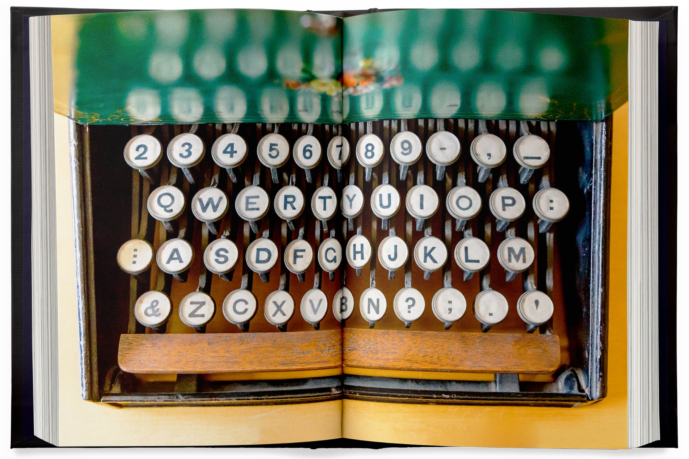

# Drawing

<figure><figcaption></figcaption></figure>

bjkj

fbekjds




<figure><figcaption></figcaption></figure>







What if QWERTY wasn’t the standard keyboard layout? A forthcoming book by Chicago-based designer and writer [Marcin Wichary](https://aresluna.org/) examines the now-ubiquitous format and how it came to dominate modern technology.

<figure><figcaption></figcaption></figure>

Fully funded a few hours after launching on [Kickstarter](https://www.kickstarter.com/projects/mwichary/shift-happens?ref=2wnl1e), [_Shift Happens_ ](https://shifthappens.site/)documents 150 years of keyboard history from early analog typewriters to the pixelated versions on our phones. The 1,200-page book is split into two volumes that encompass a broad array of innovations and feuds from “the Shift Wars of the 1880s (and) Nobel-prize winner Arthur Schawlow using a laser to build the best typo eraser (to) August Dvorak—and many others—trying to dethrone QWERTY (and) Margaret Longley and Lenore Fenton perfecting touch typing.”

<figure><figcaption></figcaption></figure>

Seven years in the making, the book features 1,300 photos of devices and typists at work, some of which document collections and archives that have never been seen before. Wichary emphasizes the cultural implications of the commonplace objects, saying he focused on the people behind the technology. “I wanted a book that told all the personal stories about keyboards tied in with a historical, social, and political context,” he shares.

To grab a copy of _Shift Happens_, head to [Kickstarter](https://www.kickstarter.com/projects/mwichary/shift-happens?ref=av4ohi), and follow Wichary on [Mastodon](https://mastodon.online/@mwichary) for updates on the project.



| Table 1 | xoox |   |
| ------- | ---- | - |
|         |      |   |
|         |      |   |
|         |      |   |



| Table 1 | xoox |   |
| ------- | ---- | - |
|         |      |   |
|         |      |   |
|         |      |   |





<figure><figcaption></figcaption></figure>




<figure><figcaption></figcaption></figure>

 

<figure><figcaption></figcaption></figure>




<figure><figcaption></figcaption></figure>
