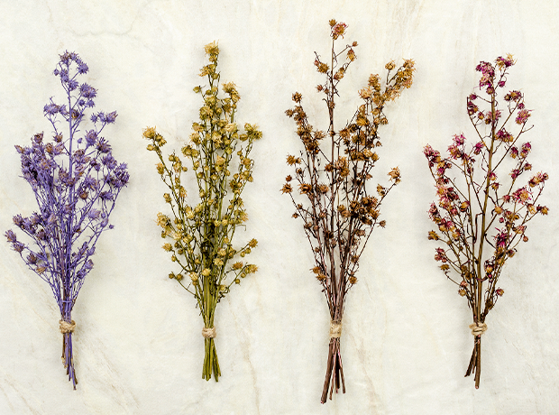
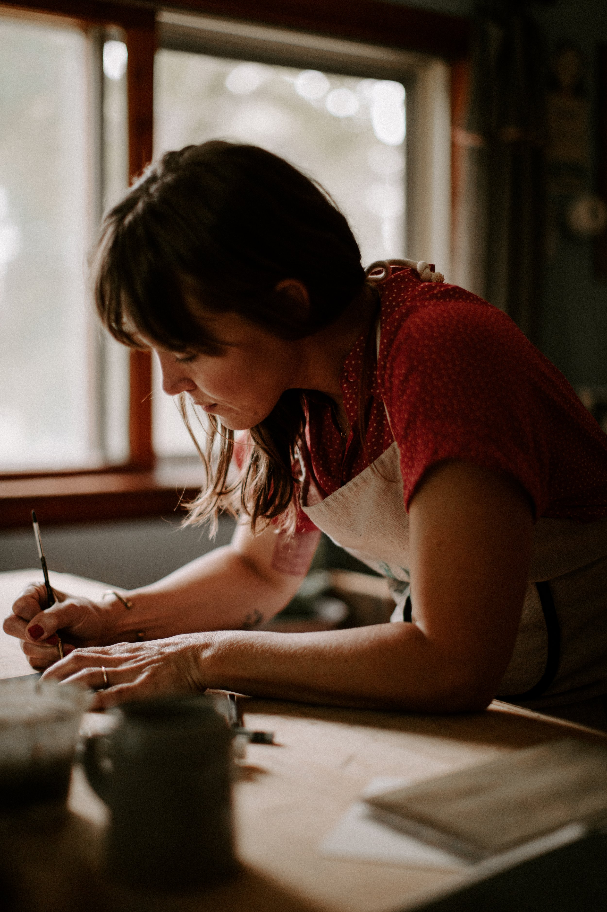

# Rebecca Green's work

### _Rebecca Green is an Illustrator &_&#x20;

Her hand painted illustrations showcase the timeless celebration of seasons, story, and home. She is most known for her work in picture books.

:smile: Hello! Making other changes here 🌼

$$f(x) = x * e^{2 pi i \xi x}$$





<figure><figcaption></figcaption></figure>

<figure><figcaption></figcaption></figure>

>
>
> Hello!
>
> Love it
>
> <pre><code><strong>// Some code
> </strong>cndsjknklx
> sznclksxm
>
>
> </code></pre>

### _Author based in Michigan._
