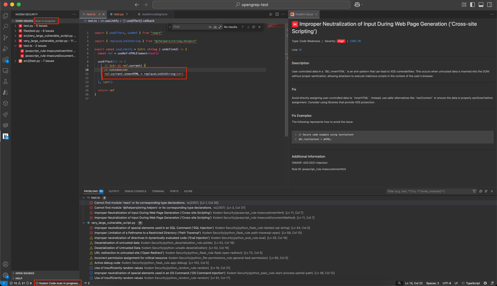
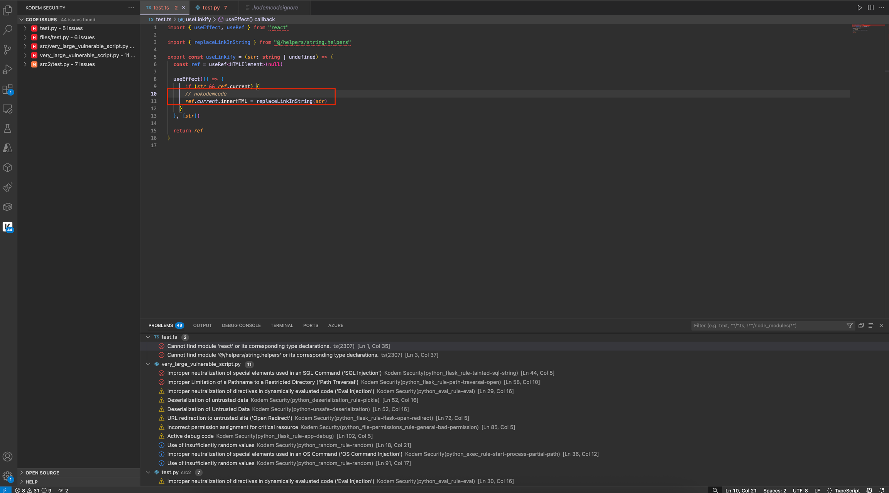

# Page 8

## Ignoring Specific Rules Per Line

Add comments to your code using language-specific syntax to ignore specific rules per line:


```
nokodemcode: rule-id
```


**Ignore Specific Rules**

For issues like **Improper Neutralization of Input During Web Page Generation**, you can ignore specific rule IDs for this line of code:

* javascript\_rule-InsecureInnerHtml
* javascript\_rule-InsecureDocumentMethod


```javascript
// nokodemcode: javascript_rule-InsecureInnerHtml, javascript_rule-InsecureDocumentMethod
```




#### Find the Rule ID

1. Locate and retrieve the Rule ID in one of two ways, through either the Kodem platform or [VS Code](https://docs.kodemsecurity.com/integrations/ignoring-code-issues#example-in-vs-code).


Multiple rules can be ignored by separating IDs with commas.


**Kodem Platform**:

1. Navigate to the [Kodem platform](https://app.kodemsecurity.com/).
2. Select your region from the dropdown menu in the upper right corner.
3. Log in by entering your organization's slug provided by Kodem.
4. Select **Issues** under **Triage** in the sidebar menu.
5. Select and issue and scroll to the bottom of the Triage drawer.

<figure><figcaption><p>Rule ID in Triage Drawer</p></figcaption></figure>



#### Add the Comment

1. Place the comment directly above or next to the line of code with issues.



#### Issue Exclusion

Once the scanning completes:

* Only the specified rule(s) that generate the issues are excluded.
* Other rule(s) that generate issues on the same line of code will still be generated and appear.



<details>

<summary>Example in VS Code</summary>

### Ignore Specific Rules

Multiple issues can be ignored by separating rule IDs with commas.

#### Find the Rule ID

1. Open VS Code.

1) Click on the Kodem extension from the Activity Bar (sidebar).
2) In your project, you can retrieve the Rule ID(s) from either:
   * The Overview panel (left sidebar). Excluding issue type in parenthesis.
   * Bottom of the Kodem Issue dedicated panel (right sidebar).&#x20;
   * Inline annotations in the editor panel. Rule ID is in the parenthesis.
   * Quick Fix actions menu shortcut.
   * Problems panel. Rule ID is in the parenthesis.

<figure><figcaption><p>Retrieve Rule ID</p></figcaption></figure>

3. Place the comment directly above or next to  the line of code with issues. The file is automatically scanned.&#x20;

<figure><figcaption><p>Ignore Specific Rules in VS Code</p></figcaption></figure>

4. Once the file completes scanning:
   * Only the specified rule(s) that generate the issues are excluded.
   * Other rule(s) that generate issues on the same line of code will still be generated and appear.

<figure><figcaption><p>Issue Exclusion in VS Code</p></figcaption></figure>

#### Copy Issue Details

Copy issue details to share with team.

1. Select the shortcut from the Quick Fix action menu in the editor panel and problems panel.
2. Past, store and share issue details.

<figure><figcaption><p>Copy Issue Details</p></figcaption></figure>

</details>

## Ignoring All Rules Per Line <a href="#validate-fixes" id="validate-fixes"></a>

Add comments to your code to ignore all rules for a specific line:


```
nokodemcode
```


**Ignore All Rules**

For issues like **Improper Neutralization of Input During Web Page Generation**, you can ignore all rule IDs for this line of code:

* javascript\_rule-InsecureInnerHtml
* javascript\_rule-InsecureDocumentMethod


```javascript
// nokodemcode
```


1. Add the comment to ignore all rules by manually entering the comment using language-specific syntax above or next to the line of code with issues.
2. All rules generating issues on that line will be excluded regardless of type.

<details>

<summary>Example in VS Code </summary>

### Ignore All Rules

1. Open VS Code.
2. Click on the Kodem extension from the Activity Bar (sidebar).
3. Place the comment directly above or next to  the line of code with issues. The file is automatically scanned.&#x20;

<figure><figcaption><p>Ignore All Rules in VS Code</p></figcaption></figure>

4. Once the file completes scanning, all the rules that generate the issue(s) on the line of code are excluded.

<figure><figcaption><p>Issues Exclusion in VS Code</p></figcaption></figure>

</details>

## Ignoring Files & Folders

Create a `.kodemcodeignore` file in your project root to specify files and directories to exclude from scanning using patterns similar to `.gitignore`:

```bash
# Common directories to exclude
node_modules/
vendor/
dist/
build/

# Ignore specific file types
*.min.js
*.test.js
*.log

# Specific files to ignore
example.txt
config.dev.json

# Include a specific file that would otherwise be ignored
!important.log

# Directory patterns
directory/        # Ignores the directory named "directory" and all its contents
directory/*       # Ignores all files and directories inside "directory", but not the directory itself
**/directory      # Ignores a directory named "directory" at any level
**/directory/     # Ignores all files and directories inside "directory" at any level
```

#### Syntax Rules

* Each line specifies a pattern
* Blank lines are ignored and can be used for readability
* Lines starting with `#` are treated as comments

#### Pattern Types

**Exact File Names**

```python
example.txt    # Ignores a file named exactly "example.txt"
```

**Wildcards**

```bash
/*.log          # Ignores all files ending with .log
file?.txt      # Matches file1.txt, file2.txt, etc.
file[123].txt  # Matches file1.txt, file2.txt, file3.txt
file[a-z].txt  # Matches filea.txt, fileb.txt, etc.
```

**Directory Exclusions**

```bash
directory/     # Ignores the directory named "directory" and all its contents
directory/*    # Ignores all files and directories inside "directory", but not the directory itself
**/directory   # Ignores a directory named "directory" at any level
```

**Negation**

```c
*.log          # Ignores all .log files
!important.log # But keeps important.log
```

<details>

<summary></summary>

<div><figure><figcaption></figcaption></figure> <figure><figcaption></figcaption></figure></div>

<figure><figcaption></figcaption></figure>

</details>

<figure><figcaption></figcaption></figure>

<figure><figcaption><p>dceds</p></figcaption></figure>

