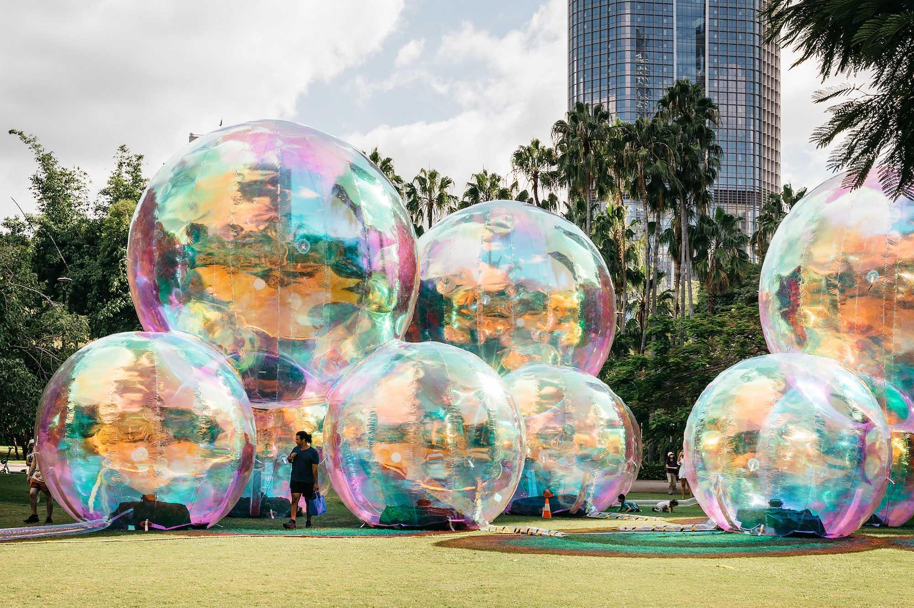
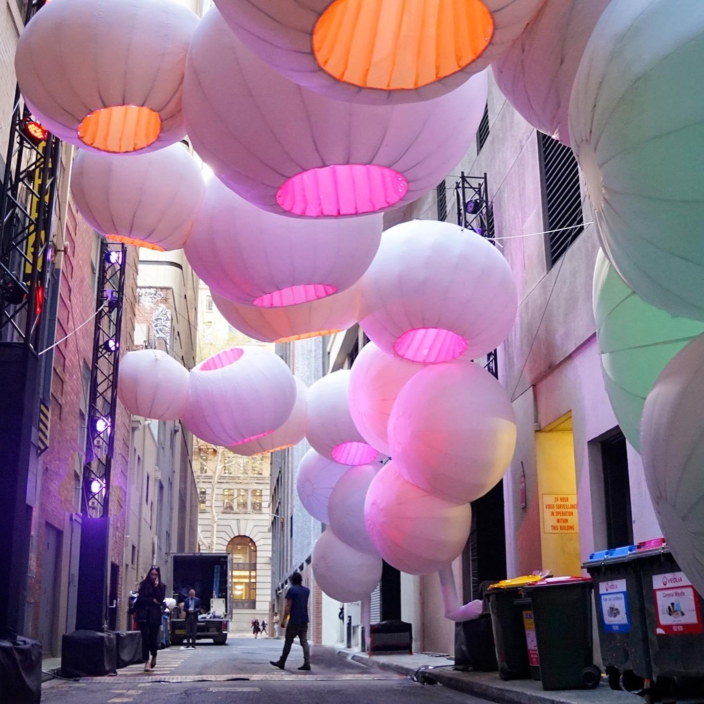

# Doc import

### [**Monumental Bubbles Pop Up in Public Spaces in Atelier Sisu’s Inflatable Installations**](https://www.thisiscolossal.com/2023/02/atelier-sisu-bubbletecture/) 

[**FEBRUARY 9, 2023**](https://www.thisiscolossal.com/2023/02/atelier-sisu-bubbletecture/)[**KATE MOTHES**](https://www.thisiscolossal.com/author/kmothes/)

sbsxnjsx

<table data-view="cards"><thead><tr><th></th><th></th><th></th><th data-hidden data-card-cover data-type="files"></th><th data-hidden data-card-target data-type="content-ref"></th></tr></thead><tbody><tr><td>Page   </td><td></td><td></td><td><a href=".gitbook/assets/image.png">image.png</a></td><td><a href="cards.md">cards.md</a></td></tr><tr><td>      </td><td>               </td><td></td><td><a href=".gitbook/assets/CleanShot 2023-01-25 at 19.27.15@2x.png">CleanShot 2023-01-25 at 19.27.15@2x.png</a></td><td><a href="page-2/">page-2</a></td></tr><tr><td>Pagewithsubpage         </td><td></td><td></td><td><a href=".gitbook/assets/image.png">image.png</a></td><td><a href="group-1/good-afternoon/">good-afternoon</a></td></tr></tbody></table>

“Evanescent.” All images © Atelier Sisu, shared with permission

\= # %

Whether illuminated by the sun or spotlights, the undulating layers of [Atelier Sisu](https://www.ateliersisu.com/)’s playful installations are a presence in public spaces. The Sydney-based studio, which is a collaboration between artists Renzo B. Larriviere and Zara Pasfield, celebrates community interaction and joy in their vibrant, inflatable designs. A buttress between art and architecture, their practice focuses on the interaction between art and the surrounding environment. “Our aim is not simply to create something beautiful or a temporary sculpture but to re-interpret our public spaces through architectural choices,” the studio says in a statement.

Atelier Sisu’s self-described “bubble-tecture” is exemplified in the iridescent spheres of “Evanescent,” which features enormous, translucent orbs that stick one another and appear to tumble across lawns or plazas. Conceived during the pandemic when the artists, like many of us, were faced with uncertainty and began to more closely consider the delicate balance of stability and the fleeting nature of time, the studio “endeavoured to communicate this feeling of transient beauty and the need to live in the moment through the idea of the bubble.” The piece has been displayed in more than 22 different cities in 12 different countries.

“Evanescent” is currently on view at Leadenhall Market in London through February 10. You can find more work on the studio’s [website](https://www.ateliersisu.com/), and follow updates on [Instagram](https://www.instagram.com/ateliersisu).

“Iris”
